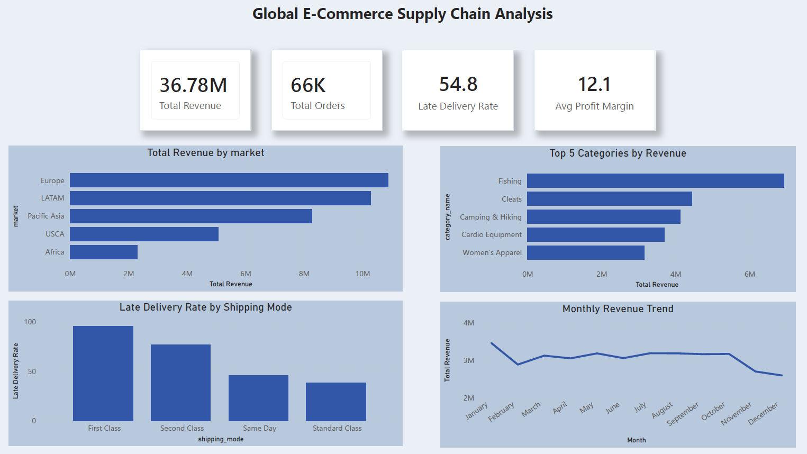

# Global E-Commerce Supply Chain Dashboard
**Tools:** Python · MySQL · Power BI  
**Dataset:** DataCo Smart Supply Chain (180,516 orders · 5 global markets · 2015–2018)  
**Raw Dataset:** [Kaggle — DataCo Smart Supply Chain](https://www.kaggle.com/datasets/shashwatwork/dataco-smart-supply-chain-for-big-data-analysis)

---

## Business Problem
A global e-commerce company is struggling with delivery performance —
over half of all orders arrive late, threatening customer retention and revenue.
This analysis identifies where, why, and how severely the supply chain is failing
across 5 global markets.

---

## Key Findings
- **$36.78M total revenue** across 180K+ orders in 5 global markets
- **54.8% of all orders were delivered late** — consistent across every market, signaling a systemic operational problem
- **Europe leads revenue at $10.87M** (29.6% of total); USCA contributes $5.07M (13.8%)
- **First Class shipping has a 95.3% late delivery rate** — premium customers are the most let down
- **Standard Class is the most reliable** at only 38.1% late — the cheapest option performs best
- **Fishing dominates product categories** at $6.93M; top 5 are all sports/outdoor products

---

## Dashboard Preview


---

## Project Structure
```
ecommerce-supply-chain-dashboard/
├── data/
│   ├── dim_categories.csv       # 51 product categories
│   ├── dim_customers.csv        # 20,649 unique customers
│   ├── dim_date.csv             # 1,127 order dates (2015–2018)
│   ├── dim_departments.csv      # 11 departments
│   └── dim_products.csv         # 118 products
│   (fact_orders: 180K rows — too large for GitHub, see Kaggle link above)
├── notebooks/
│   └── 01_cleaning_eda.ipynb    # Cleaning, star schema creation, 5 EDA charts
├── sql/
│   └── ecommerce_analysis.sql   # 5 business queries with findings
├── images/
│   ├── 01_sales_by_market.png
│   ├── 02_late_delivery_by_market.png
│   ├── 03_top_categories.png
│   ├── 04_monthly_sales_trend.png
│   ├── 05_delivery_status.png
│   └── dashboard_screenshot.png
└── README.md
```

---

## Steps Taken
1. **Data Cleaning** — Removed PII columns (email, password, name), fixed Latin-1 encoding, dropped <1% missing rows from 180,519 raw records
2. **Star Schema Design** — Split flat file into 6 normalized tables (1 fact table + 5 dimension tables) using Python Pandas
3. **EDA in Python** — 5 charts analyzing revenue by market, late delivery rates, top product categories, monthly trends, and delivery status breakdown
4. **SQL Analysis** — 5 MySQL business queries covering revenue share by market, category profitability, shipping mode performance, and delivery impact
5. **Power BI Dashboard** — 4 KPI cards + 4 visuals built on a star schema model with DAX measures for revenue, orders, late delivery rate, and profit margin
